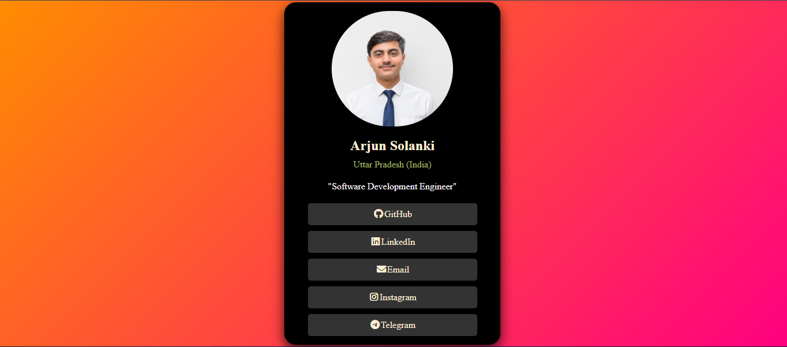

# Social-Media-Links

🔗 Social Media Links (HTML + CSS)

A modern and responsive Social Media Links page built using HTML and CSS.  
This project helps showcase all your social profiles in one stylish landing page with a clean and attractive UI.

✨ Features

    🌐 Responsive design for mobile and desktop
    🎨 Modern and clean user interface
    🔗 Add multiple social media profile links
    🖱️ Hover animations and smooth transitions
    🌙 Light / Dark theme support
    🖼️ Profile image / avatar section
    📝 Short bio or intro text
    📱 Mobile-friendly layout
    ⚡ Fast loading and lightweight design
    🎯 Easy to customize colors, fonts, and icons

🛠️ Technologies Used

    HTML5
    CSS3
    Font Awesome Icons
    Google Fonts

📂 Supported Platforms

    Instagram
    Facebook
    LinkedIn
    GitHub

A simple and elegant card design using HTML and CSS. The card includes links to social media platforms with a modern and visually appealing layout. Perfect as a beginner's practice project.

